# 一个可以让剪刀自己动的装置
暂时材料还没到，安装教程晚点写

## 电气部分
**准备材料**
|序号|名称|数量|
| - | - | - |
| 1 |GA25-370减速电机|1|
| 2 | 导线 | 2 |
| 3 | DC 5.5*2.1MM母座 | 1 |
| 4 | XH2.54弯针母座3P | 1 |
| 5 | 0.1uF瓷片电容 | 1 |
| 6 | PWM直流电机调速器 | 1 |
| 7 | 自制PCB转接板 | 1 |

**准备工具**

电烙铁、焊锡丝、斜口钳

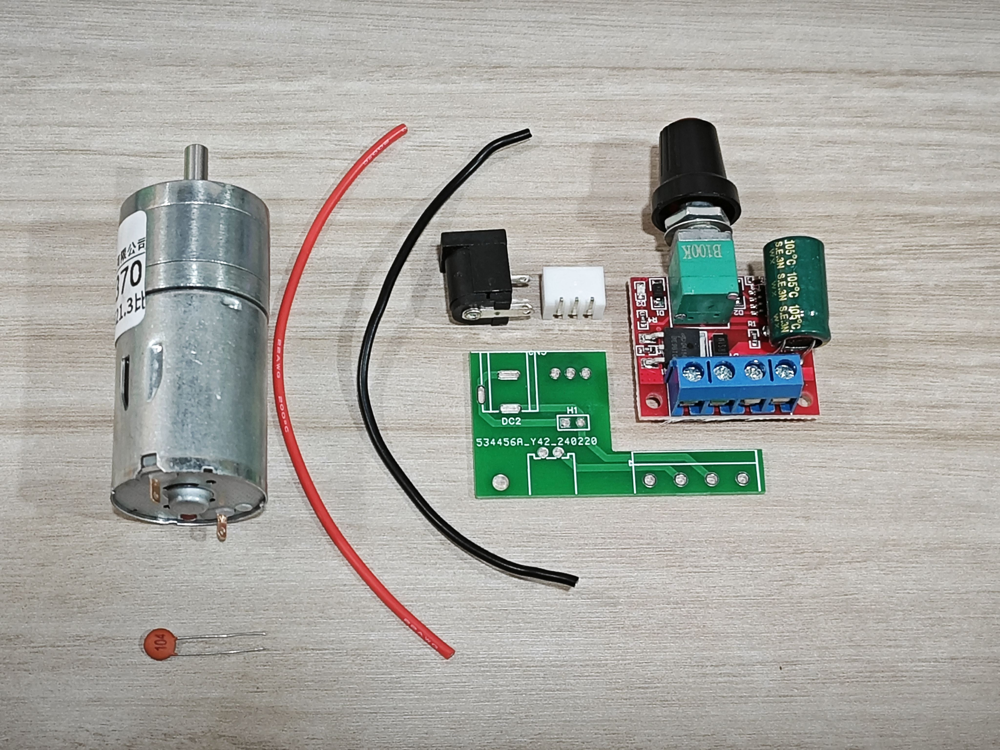

如下图所示将器件焊接在转接板上

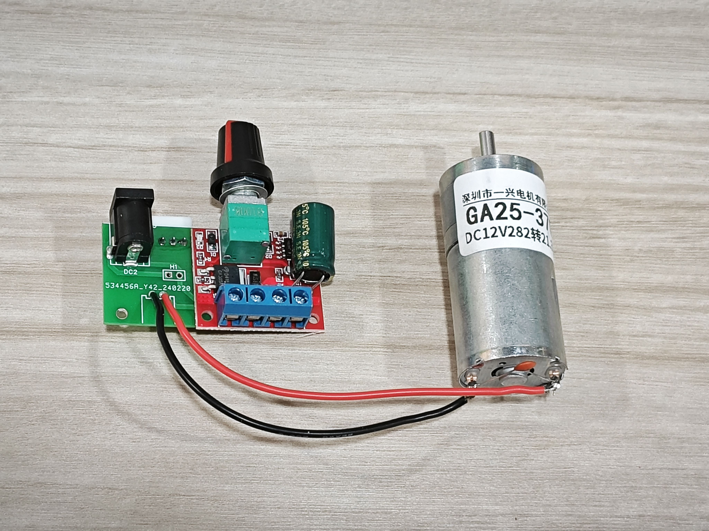

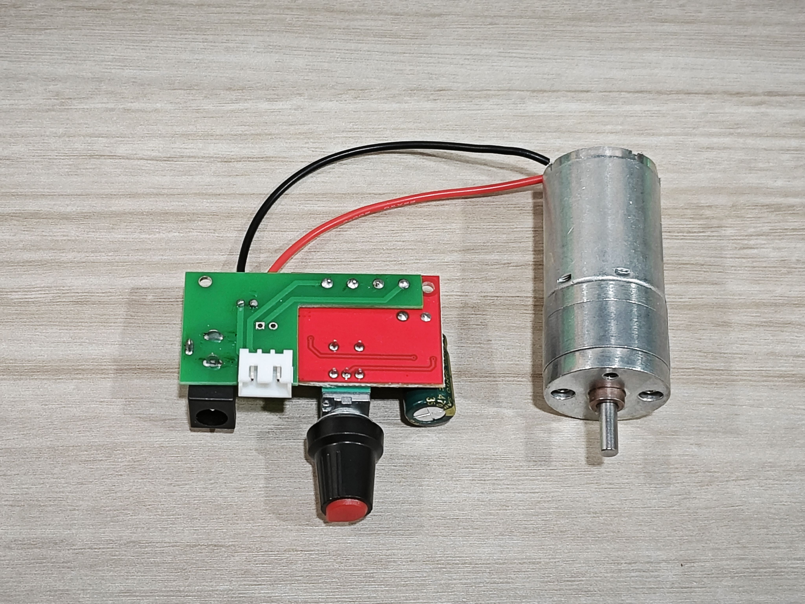

## 组装

安装电机
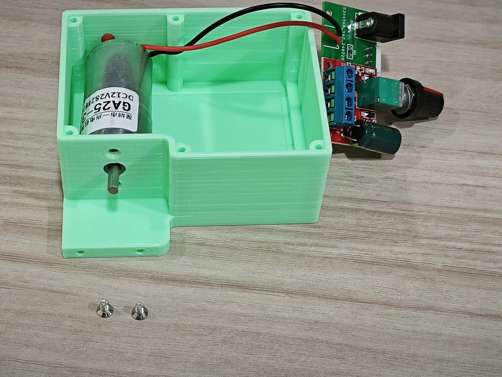

安装控制板
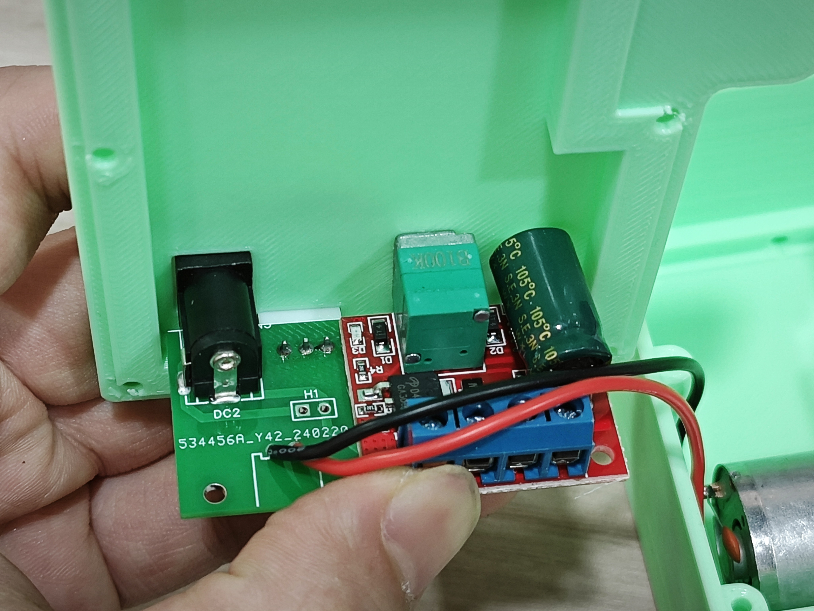

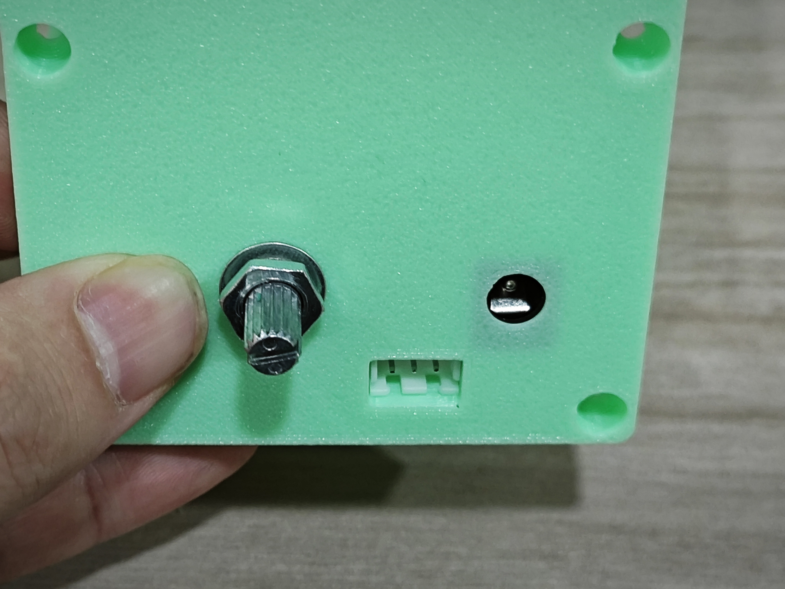

准备铜螺母
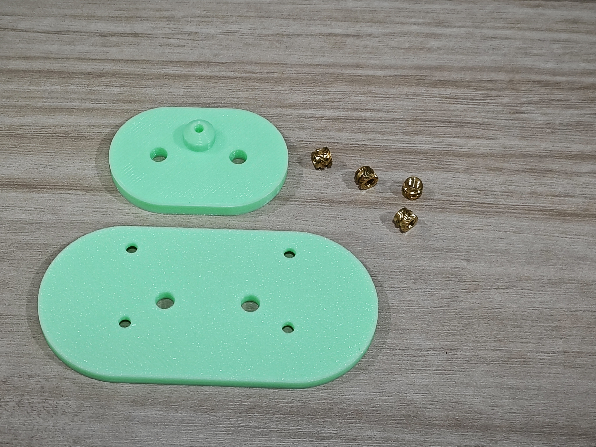
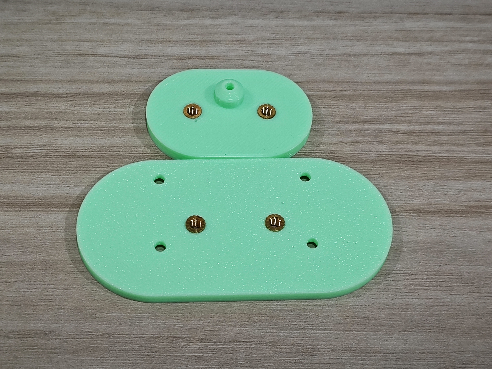

安装轴承
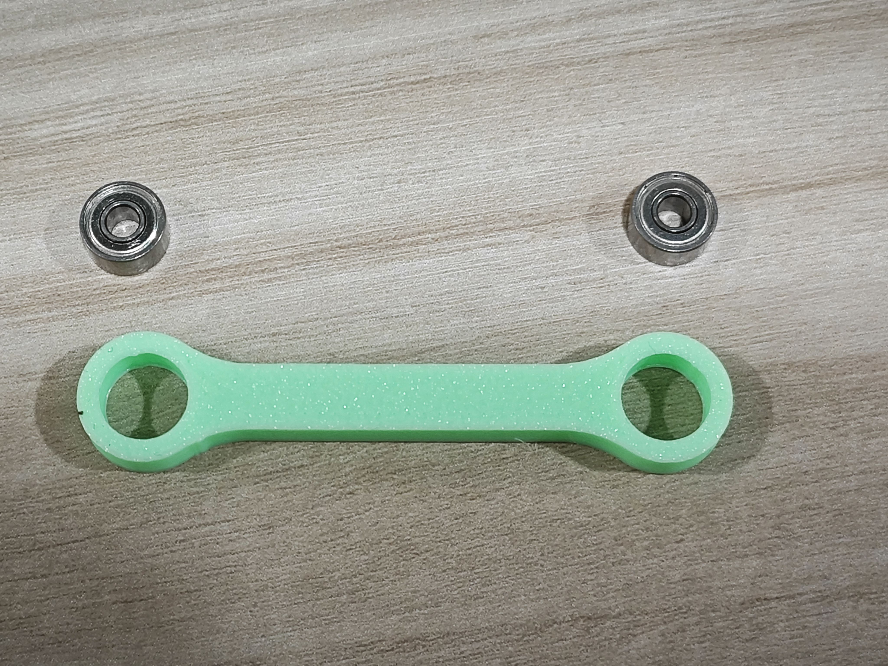

安装连接件
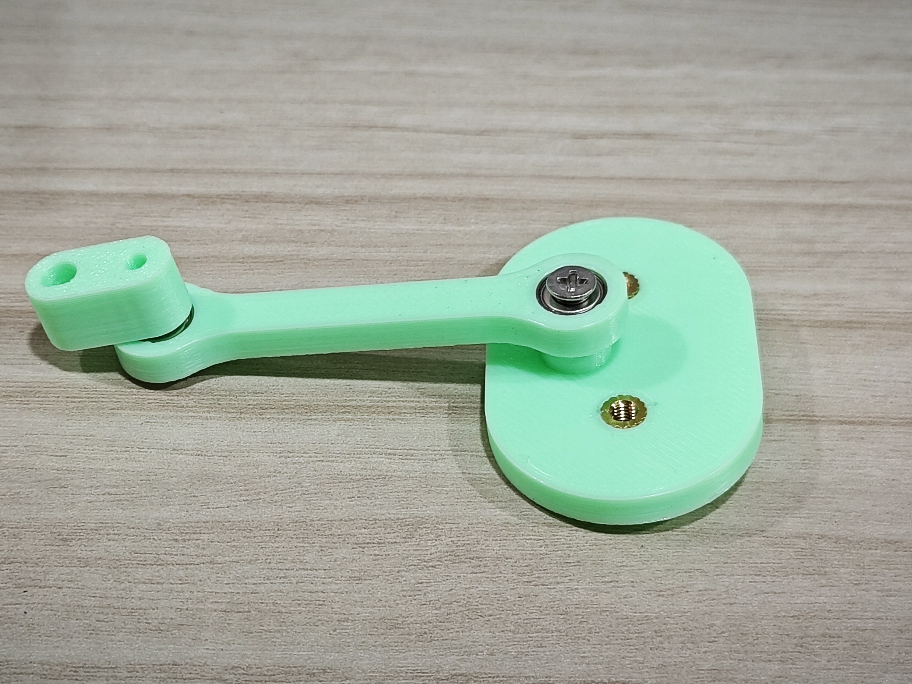
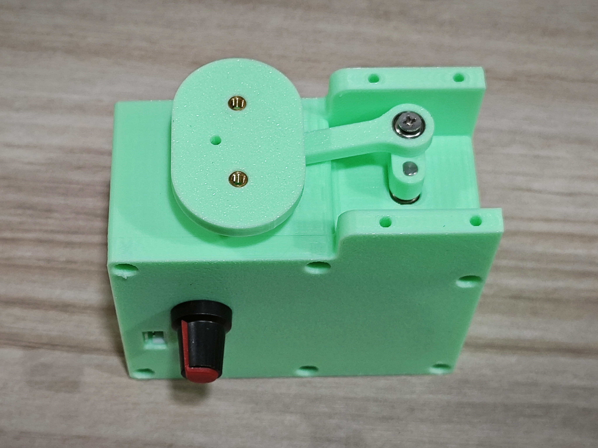

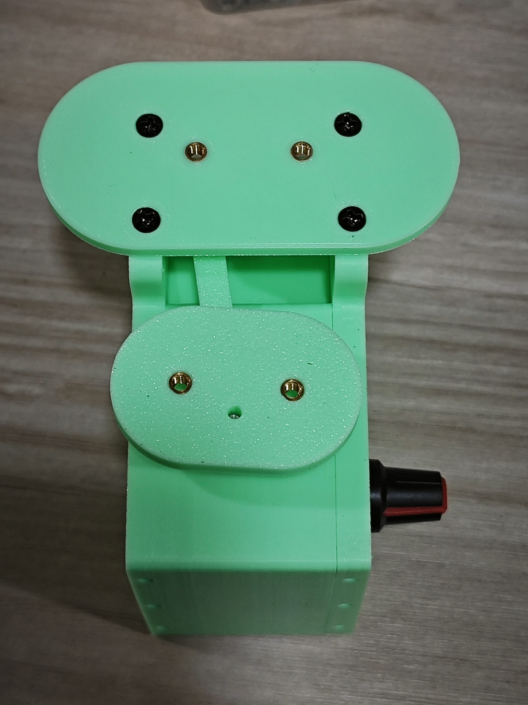

